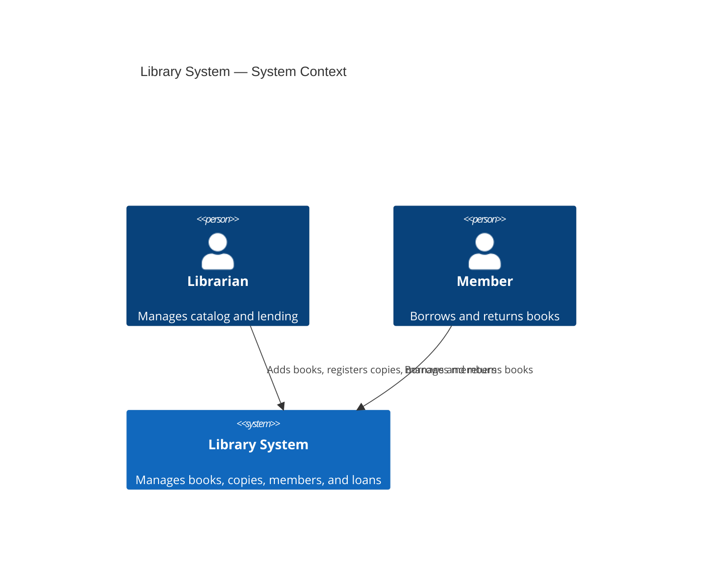
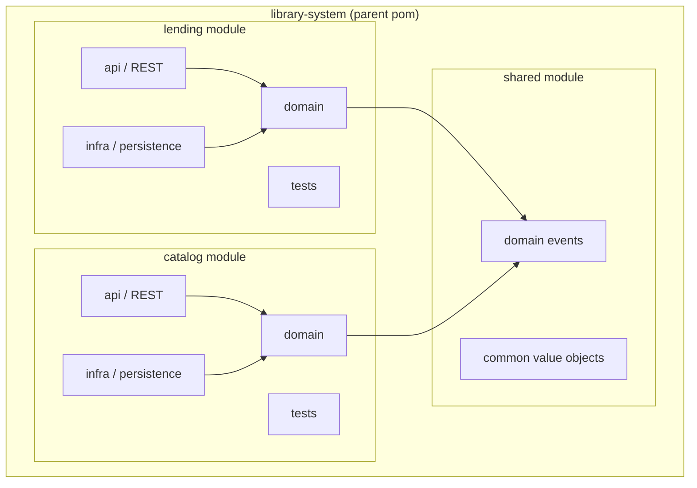

## Overview

The library system follows a modular monolith architecture with bounded context isolation enforced at the Maven module level. Each bounded context has its own module with a hexagonal (ports & adapters) internal structure.

## Module Structure

## Hexagonal Architecture (per module)

Each bounded context follows hexagonal architecture internally:

- **Domain** (center) — entities, value objects, domain events, repository interfaces. No framework imports.
- **API** (inbound adapter) — REST controllers, request/response DTOs, mapping to domain commands
- **Infra** (outbound adapter) — JPA repositories, event publishing, external system clients
- **Tests** — BDD tests (Cucumber), unit tests (JUnit 5), architecture tests (ArchUnit)

## Key Technical Decisions

- **Modular monolith** — not microservices. Bounded contexts are Maven modules within one deployable unit.
- **In-process domain events** — Spring's `ApplicationEventPublisher` for inter-context communication. Can be replaced with messaging later (see ADR if needed).
- **H2 for development** — in-memory database for fast iteration. PostgreSQL for production (deferred).
- **REST API** — one API module per bounded context, exposed at `/api/catalog/*` and `/api/lending/*`