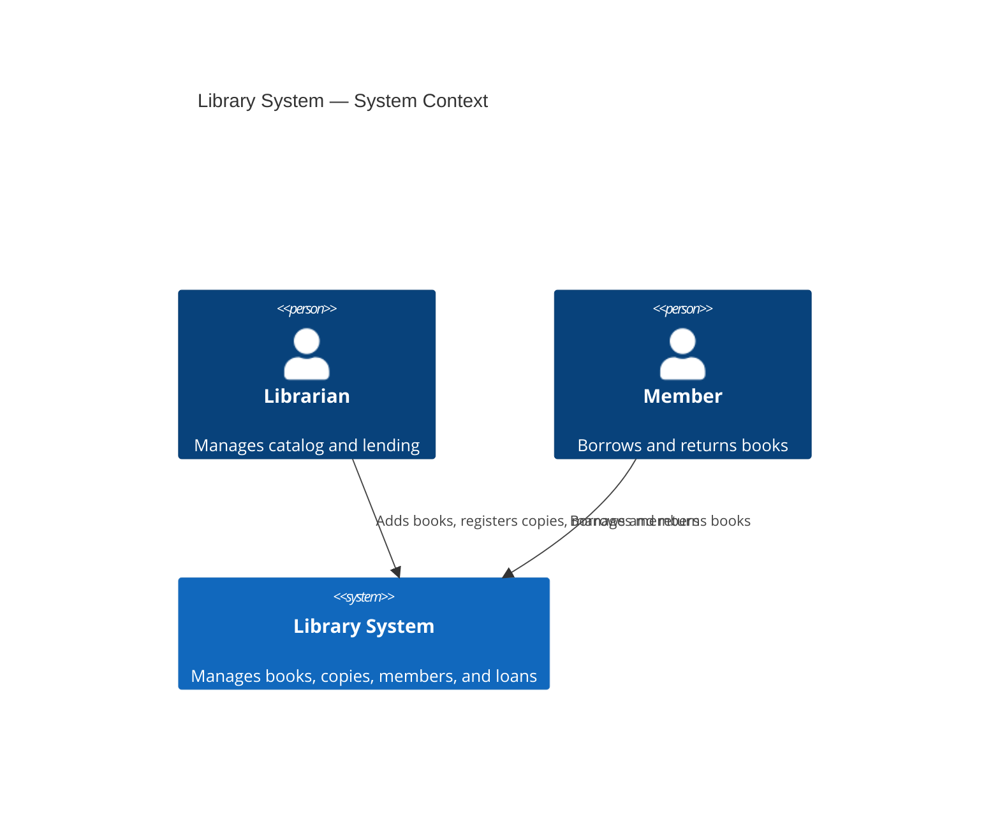
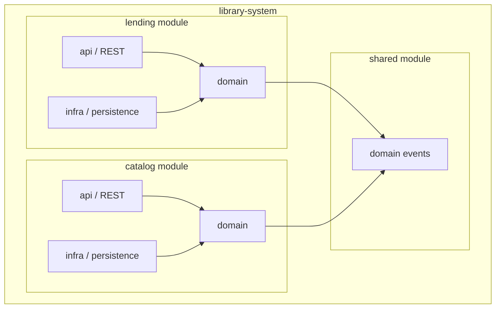

## System Context

```mermaid
C4Context
  title Library System — System Context

  Person(librarian, "Librarian", "Manages catalog and lending")
  Person(member, "Member", "Borrows and returns books")

  System(library, "Library System", "Manages books, copies, members, and loans")

  Rel(librarian, library, "Adds books, registers copies, manages members")
  Rel(member, library, "Borrows and returns books")
```

## Module Structure

```mermaid
graph TB
  subgraph "library-system"
    subgraph "catalog module"
      CD[domain]
      CA[api / REST]
      CI[infra / persistence]
    end
    subgraph "lending module"
      LD[domain]
      LA[api / REST]
      LI[infra / persistence]
    end
    subgraph "shared module"
      SE[domain events]
    end
  end

  CA --> CD
  CI --> CD
  LA --> LD
  LI --> LD
  LD --> SE
  CD --> SE
```
