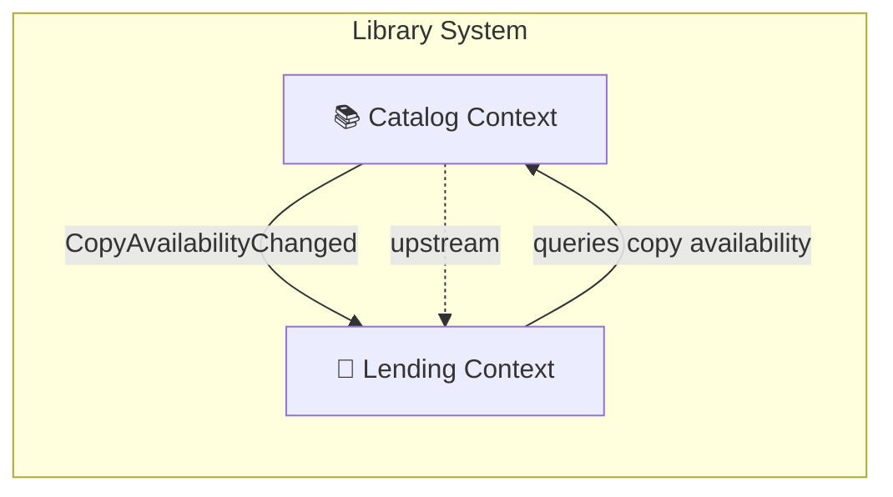

## Overview

The library system consists of two bounded contexts that collaborate to manage the library's collection and lending operations.

## Contexts

| Context | Responsibility |
|---|---|
| **Catalog** | Manages the library's collection — books, authors, copies, and their availability status |
| **Lending** | Manages members, loans, returns, overdue detection, and fee calculation |

## Relationships

### Catalog → Lending (Upstream / Downstream)

- **Catalog** is the upstream context — it owns the truth about which books and copies exist and whether they are available.
- **Lending** is the downstream context — it consumes availability information to decide whether a loan can be created.
- **Integration pattern:** Domain events. Catalog publishes `CopyAvailabilityChanged` events. Lending subscribes to stay in sync.
- **Conformist:** Lending conforms to Catalog's model of what a "copy" is — it does not redefine book or copy concepts.

### Lending → Catalog (Query)

- Lending may query Catalog for current copy availability before creating a loan.
- This is a synchronous read — no state mutation in Catalog.