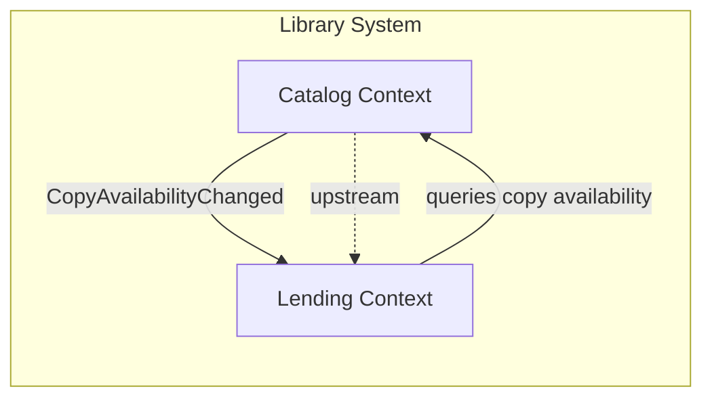

## Overview

## Relationships

### Catalog → Lending (Upstream / Downstream)

- Catalog publishes `CopyAvailabilityChanged` events. Lending subscribes to stay in sync.
- Lending conforms to Catalog's model of what a "copy" is — it does not redefine book or copy concepts.

### Lending → Catalog (Query)

- Lending may query Catalog for current copy availability before creating a loan (synchronous read, no state mutation).
